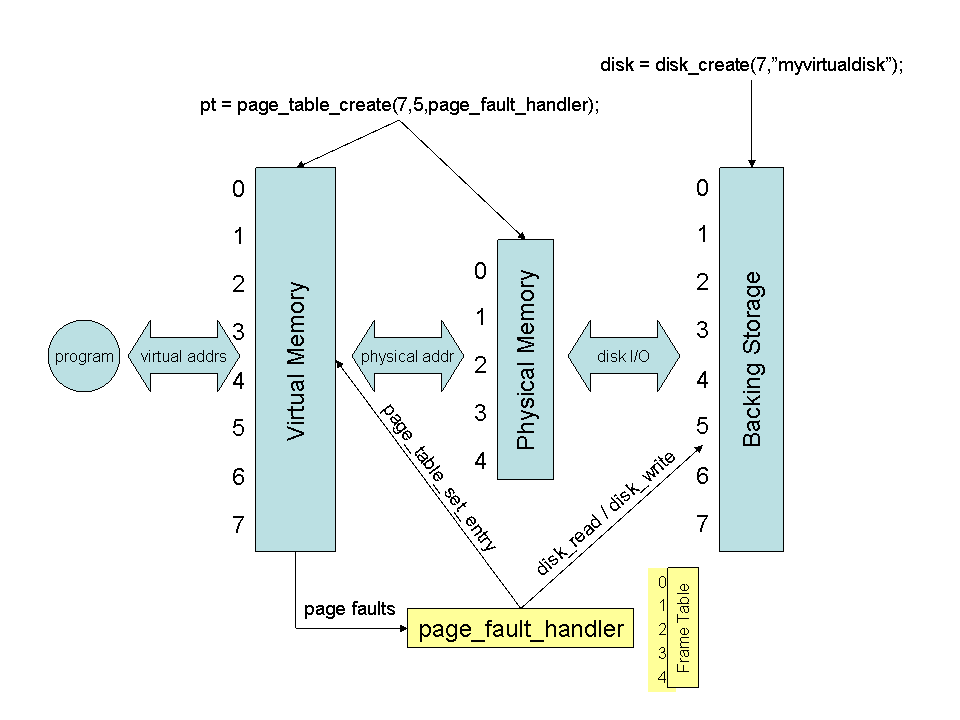
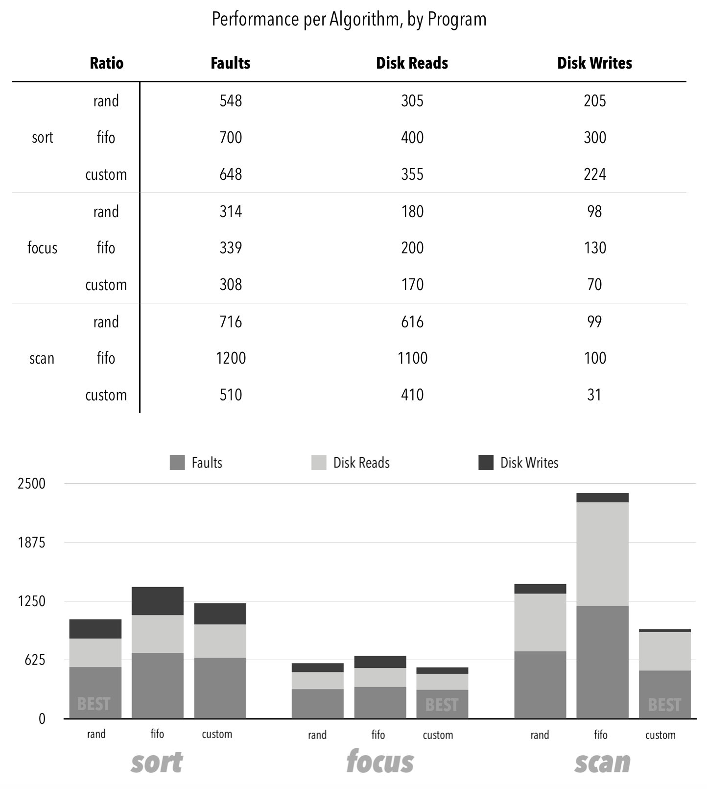

# Operating Systems Project 5
A simple but fully functional demand paged virtual memory

A project by [Michael McRoskey](http://michaelmcroskey.com/) (mmcrosk1) and [Maggie Thomann](http://maggiethomann.com/) (mthomann)

Project Overview
--------

- [Project Requirements](http://www3.nd.edu/~dthain/courses/cse30341/spring2017/project5/project5.html)

Operating Systems Project 5 is a page fault handler tool that will trap page faults and identify the correct course of action, which generally means updating the page table, and moving data back and forth between the disk and physical memory.  The OS course at Notre Dame provided us with code that implements a "virtual" page table and a "virtual" disk and so our job was to handle any page fault errors that could result.  A user will run `./virtmem NUM_PAGES NUM_FRAMES PAGE_REPLACEMENT_ALGORITHM PROGRAM` (described below) and the output will report:

1. the number of page faults
2. the number of disk writes
3. the number of disk reads and the
4. result of the `PROGRAM` chosen

|       Command Line Argument       |                 Description               |
|-----------------------------------|-------------------------------------------|
|  `NUM_PAGES`		                | # of pages for the page table to have; should be greater than the number of frames to demonstrate page fault functionality |
|  `NUM_FRAMES`                     | # of frames physical memory will contain |
| `PAGE_REPLACEMENT_ALGORITHM`      | Options are (1) `rand`, (2) `fifo`, or (3) `custom`; this will determine how to handle page faults |
| `PROGRAM`			                | Program to run; options are (1) `sort`, (2) `scan`, or (3) `focus` | 

## Files
1. **`main.c`**: This file creates the virtual disk, initializes the page table, creates the frame table, runs the selected `PROGRAM` and handles any page faults that result.  Finally, it prints out a summary of page faults.
2. **`Makefile`**: Running the command `make` in this directory will properly compile the page table, disk, main program, and `PROGRAM` selected.
3. **`program.h`**: Header file for the `PROGRAM` implementation
4. **`program.c`**: Contains functions to run the `PROGRAM` the user specified and outputs the result
5. **`disk.h`**: Header file for the disk implementation
6. **`disk.c`**: Contains the functionality for disk writing, disk reading, opening & closing the disk
7. **`page_table.h`**: Header file for the page table implementation
8. **`page_table.c`**: Contains the functionality for maintaining the status of the page table (setting an entry in the page table, getting an entry in the page table, etc. etc.)
9. **`README.md`**: Describes how to build, run, and configure code

## System Requirements
System should have a `gcc` compiler installed and be able to compile with the following flags:
- `-g`
- `-Wall` for errors
- `-c` 

## Usage
1. Decide values for the following parameters you would like to test for virtual memory: (1)`NUM_PAGES`, (2)`NUM_FRAMES`, (3) `PAGE_REPLACEMENT_ALGORITHM`, & (4) `PROGRAM`
2. Run `$ make` to build the executables.
3. Run `$ ./virtmem NUM_PAGES NUM_FRAMES PAGE_REPLACEMENT_ALGORITHM PROGRAM` to simulate virtual memory.
4. The program will output the number of page faults that occured, the number of disk reads and the number of disk writes, and the result of the specific `PROGRAM`.
5. Run `$ make clean` to delete `*.dSYM` files and executables.

## Report

### Purpose of the Experiments & Experimental Set-up

The purposes of the experiments described below are:

1. To determine if it is better, on the whole, to have the number of frames be closer to the number of page OR the number of frames be farther away from the number of pages in terms of page faults, disk reads, and disk writes

2. To determine the page replacement algorithm that results in the fewest number of page faults, disk reads and disk writes for each specific program (`sort`, `focus`, & `scan`) by measuring how the ratio of page number to frame number affects the statistics AND to show that `custom` performs better than `rand` or `fifo` (results in fewer disk writes and disk reads) in certain scenarios

### Custom Page Replacement Algorithm Explanation

When invoked, the `custom` page replacement algorithm searches for a clean frame to evict instead of a dirty frame.  This results in fewer disk writes.  If the custom page replacement algorithm cannot find any clean frames, it simply uses fifo to find an appropriate frame to evict.  
	A more detailed description of exactly how custom works is as follows:
	
* Start with the first frame in the frame table and check to see if its permissions are just read (permissions is kept track of as an integer array in the struct `frame_table`, where retrieving `FT.permissions[i]` (where FT is the global frame table) would retrieve the integer value of the permissions associated with frame number i)
* If the permissions are only read (i.e. equal to 1), return this frame as the one to evict because by doing so, it won’t be necessary to write it back to disk
* If the permissions aren't 1, continue searching through the permissions array of the frame table to find a frame number which does have permissions 1
* If it’s not possible to find a frame number that has read only permission, use `fifo` to find a frame number.

### Results

As the number of frames to pages increases, in terms of the SUM of the number of page faults, disk reads, and disk writes altogether (and after ignoring our outlier values - more described below) the best page replacement algorithm for the program: 

* `scan` is `custom`
* `focus` is `custom`
* `sort` is `rand`

### Explanation of Results

We tested our implementations for frame to page ratios of 0.2, 0.4, and 0.6 and 0.8; however, with the 0.2 and 0.4 ratio tests, `custom` performed extremely poorly and so we didn’t include those outlier in this graph.  This graph is for ratios 0.6 and 0.8, averaging the results in each case. Overall, `focus` required the fewest operations by any replacement technique, followed by `sort` and `scan`. Notably, the `fifo` implementation affected `scan`’s disk reads and faults significantly. On the whole, our data showed that our `custom` implementation performed better than `rand` and `fifo` replacement implementations, with the exception of the `sort` program, in which case only `rand` performed better.   

